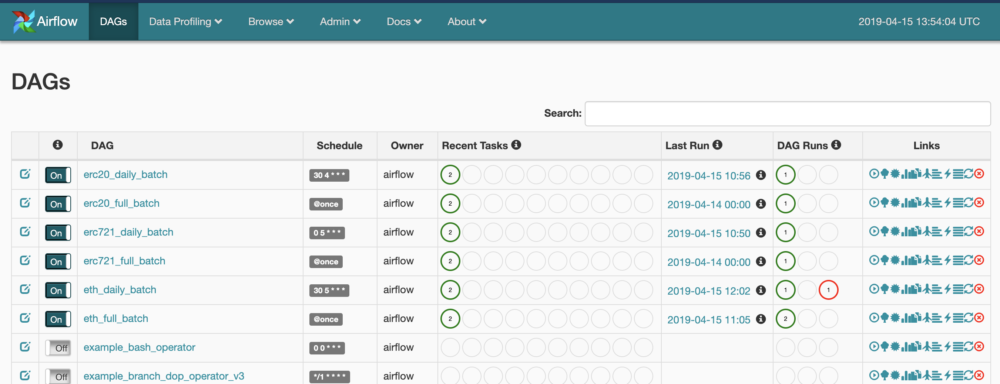
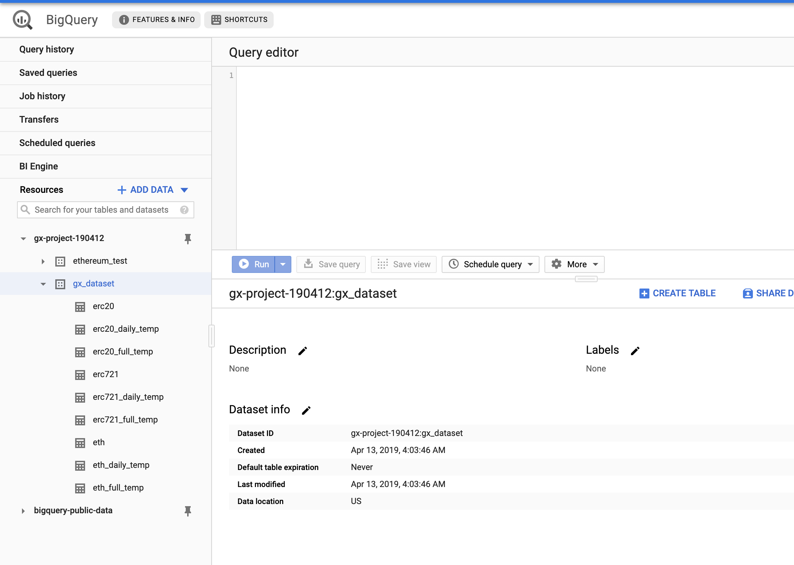
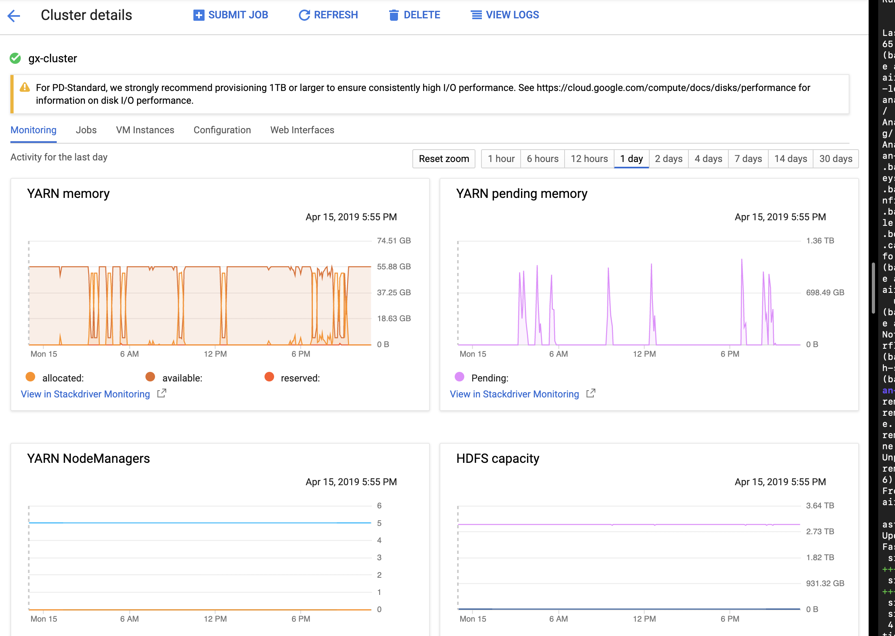

# GX Project: Etherscan-like

## 1. Description

- Author: Jisung Lim
- Contact: [email](iejisung@gmail.com), [Github](https://github.com/jisunglim)

## 2. Data Pipeline  Architecture

- [Airflow](http://35.221.108.101:8090/admin/)


- BigQuery


- Spark Cluster


## 3. Project Structure

1. 기본 프로젝트 구조는 다음과 같습니다.

    ```
    proj-- .keystore/
        |- dags/
        |- srcs/ --- dashboard/
        |         |- ethereum/
        |         |- erc20/
        |         \- erc721/
        \- setup.sh
    ```

-  `setup.sh`: 본 프로젝트는 `Airflow`와 `gcloud` 등을 사용합니다. 이를 위해 간단한 패스 설정을 합니다.

- `.keystore/`: 본 프로젝트의 data infra는 Google Cloud에서 제공하는 `Compute engine`, `Storage`, `Dataproc`, `BigQuery`를 활용하였습니다. `Dataproc` 클러스터에 분산 컴퓨팅이 필요한 job을 할당한다거나, Storage에 임시로 datalake를 구축하는 등 리소스 사용에 대한 권한 문제를 위한 key를 저장해놓은 폴더입니다.

- `dags/`, `srcs/ethereum/`, `srcs/erc20/`, `srcs/erc721/`: dags폴더에 apache Airflow에서 사용하는 dag 파일들이 들어있고, 각 dag파일들은 `srcs/*/` 폴더에 있는 개별 task들을 사용합니다. 각 폴더들은 과제 Part 1~3에서 제시된 full batch job와 daily batch job에 대한 소스코드를 포함합니다.

## 4. TODO: Part 4

- `Redis`, `React`, `Dash` 기반의 UI 작성
